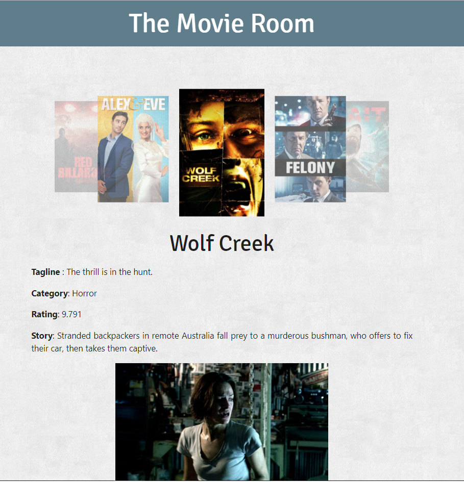
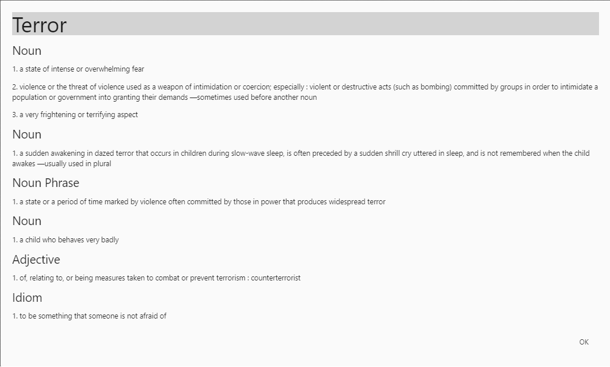

# The Movie Room
An application for users to browse and select Australian movies.

## User Story
As an immigrant, I want to learn about Australian culture so that I better understand Australian slang by watching Australian movies.

## Links

-  Github
> https://github.com/StephanieGeorgiadis/The-Movie-Room

-  Github Pages (Deployed page)
> https://stephaniegeorgiadis.github.io/The-Movie-Room/

 
 ## This application works as follows
  
1. User could select a movie from the list shown in carousel.
2. Application will show the selected movie details below the carousel
3. If user is not sure about the meaning of a word shown in details, user could double click the word to select the word.
4. Application will show the meanings and usages of the selected word in a pop up.
5. If any word int he pop up is double-clicked, it will show the new word details.

 

## Getting Started

This is a single page website using React. To get a copy, fork the repository.

### Prerequisites

It needs browser to run the application.

### Installing

After forking the repository, clone repository to local machine.

Open the application in a default browser or run usin live server.

## Running the tests

There are no automated tests for this application

## Deployment
The application is currently deployed in GitHub Pages.
Follow Heroku CLI (or specific to the deployment platform) standard deployment method to deploy the application.

## Built With

- [Materialize](https://materializecss.com/) - The CSS framework used
- [AJAX](https://api.jquery.com/jquery.ajax/) - The JavaScript framework used
- [TMDB APIs](https://api.themoviedb.org/3/movie/) - The APIs used

## Versioning

We use [Git](https://git-scm.com/) for versioning.

## Authors

[Stephanie Georgiadis](https://github.com/StephanieGeorgiadis)
[Jameskutty Sebastian](https://github.com/JameskuttySebastian)

## License

This project is licensed under the MIT License - see the [LICENSE.md](LICENSE.md) file for details

## Acknowledgments